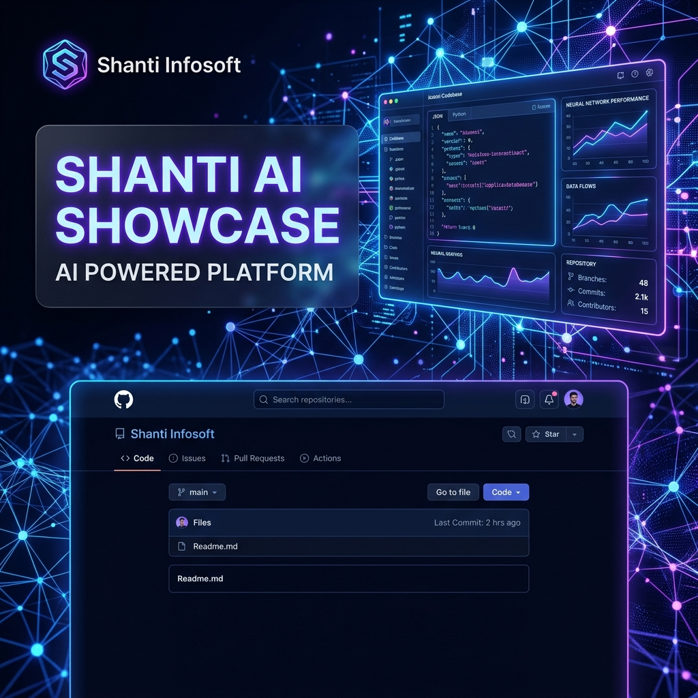
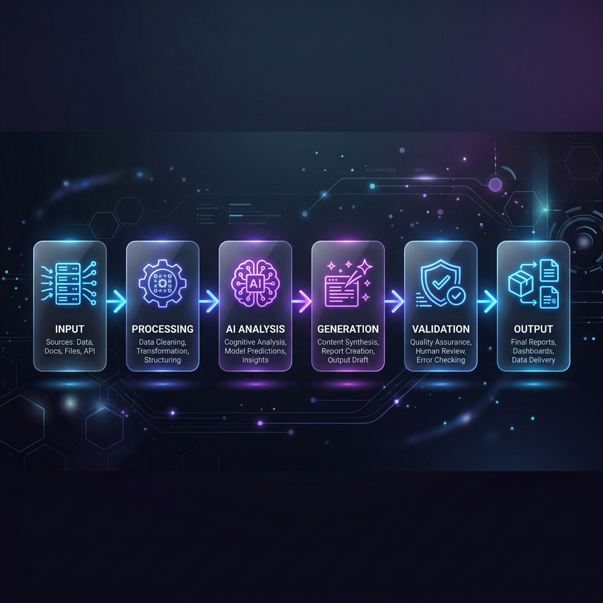

<p align="center">

</p>

<p align="center">
  <strong>The official web portfolio for Shanti Infosoft—displaying state-of-the-art AI implementations, automated workflows, and intelligence agents.</strong>
</p>

<p align="center">
  <a href="https://github.com/shanti-python/Ai-Project-showcase/blob/main/LICENSE">
    
  </a>
  <a href="https://github.com/shanti-python/Ai-Project-showcase/releases">
    
  </a>
  
</p>

<p align="center">
  <a href="https://ai-projects-display.vercel.app/" target="_blank">Live Showcase</a> •
  <a href="#project-structure">Website Structure</a> •
  <a href="https://github.com/shanti-python/Ai-Project-showcase/issues">Report Website Issue</a>
</p>

---

## 📖 About The Website

This codebase contains the official single-page portfolio website for **Shanti Infosoft**. It showcases our active capabilities and implementations in production-grade Artificial Intelligence (Agentic systems, Voice agents, Computer Vision, and secure cloud pipelines) for clients worldwide. 

The website utilizes a lightweight Flask server for routing and a highly optimized, high-fidelity responsive frontend featuring modern dark-mode glassmorphism and scroll reveal animations.

---

## 🎨 System Architecture

This diagram illustrates the cloud layout of how the showcase platform serves visitors and references third-party embeds:

<p align="center">

</p>

---

## ⚡ Showcase Workflow

The step-by-step request flow when users visit the portfolio and interact with the project video presentations:

<p align="center">

</p>

---

## 🌟 Capabilities Showcased

The website is designed to catalog and present our capabilities across six key areas:

* **Agentic AI & MCP:** Autonomous tool-calling workflows utilizing Model Context Protocol.
* **Generative AI & LLMs:** Custom LLM fine-tuning and brand-aligned asset generation.
* **Enterprise RAG Solutions:** Private company document Q&A systems.
* **Conversational Voice AI:** Direct phone-integrated real-time speech assistants.
* **Computer Vision Security:** Anti-spoofing facial detection and identity liveness checks.
* **Workflow Automation:** Organic growth scripts and cloud community controls.

---

## 🛠️ Web Tech Stack

| Layer | Technology | Purpose |
| :--- | :--- | :--- |
| **Frontend** | HTML5, CSS3 (Vanilla), JavaScript, Jinja2 Templates | Responsive glassmorphism page layout & animations |
| **Backend** | Flask (Python 3.10+) | Server routing and local hosting framework |
| **Server/WSGI** | Gunicorn | Production-grade WSGI HTTP Server |
| **Media Embedding** | Loom, Google Drive Embed APIs | Streaming project video demonstrations |
| **Infrastructure** | Vercel Serverless, Render IaC (`render.yaml`) | Continuous Cloud Deployments |

---

## 📁 Project Structure

```bash
AI-projects-display/
├── assets/
│   ├── banner.png        # Repository hero banner
│   ├── architecture.png  # Web architecture diagram
│   └── workflow.png      # AI showcase workflow diagram
├── app.py                # Flask Server Router
├── vercel.json           # Vercel deployment configuration
├── render.yaml           # Render deployment configuration
├── requirements.txt      # Python dependencies
├── templates/
│   └── index.html        # Glassmorphic responsive frontend (35KB)
└── README.md             # Project README
```

---

## 💻 Local Preview & Development

To preview the portfolio website locally:

1. **Clone this repository:**
   ```bash
   git clone https://github.com/shanti-python/Ai-Project-showcase.git
   cd AI-projects-display
   ```

2. **Configure Virtual Environment:**
   ```bash
   python3 -m venv venv
   source venv/bin/activate
   ```

3. **Install Dependencies:**
   ```bash
   pip install -r requirements.txt
   ```

4. **Launch Server:**
   ```bash
   python app.py
   ```
   Open `http://127.0.0.1:5000/` in your browser.

---

## 🌍 Cloud Deployment

The website is configured to deploy instantly on Vercel or Render.

### Vercel Deployment (Recommended)
This website includes `vercel.json` for serverless execution:
1. Install Vercel CLI: `npm i -g vercel`
2. Run `vercel` in the project root folder.

### Render Deployment
1. Connect this repo to Render.
2. Select **Web Service** (Render automatically reads `render.yaml`).

---

## 🗺️ Website Roadmap

- [x] High-fidelity glassmorphic dark theme
- [x] Responsive grids for all project cards
- [x] Embed integrations for Loom and Google Drive videos
- [x] Vercel serverless deployment support
- [ ] Direct inquiry form connection
- [ ] Admin panel to add/edit project cards dynamically
- [ ] Access statistics dashboard

---

<p align="center">
  Built with ❤️ by <strong>Shanti Infosoft</strong>
</p>

<p align="center">
  🚀 AI Solutions • 🤖 Automation • ⚡ Scalable Products • 🌍 Global Innovation
</p>
