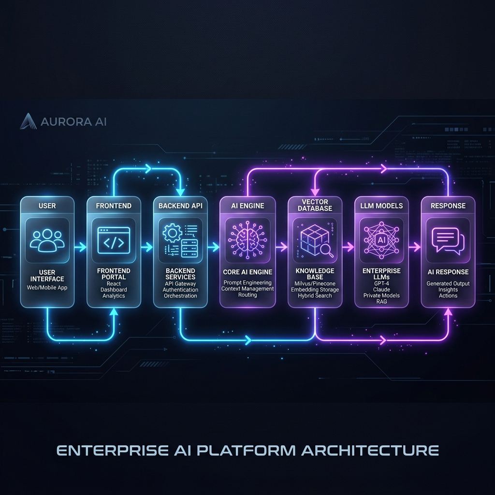
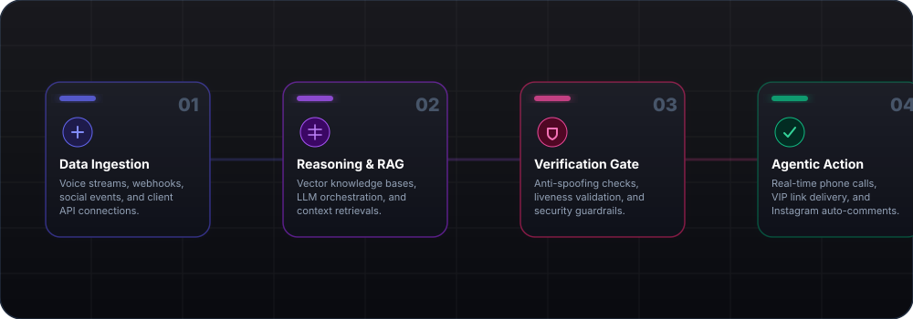

<p align="center">
  <strong>The official enterprise showcase repository for Shanti Infosoft—demonstrating production-ready AI agent architectures, computer vision security, and hyper-automation pipelines.</strong>
</p>

<p align="center">
  <a href="https://github.com/shanti-python/Ai-Project-showcase/blob/main/LICENSE">
    
  </a>
  <a href="https://github.com/shanti-python/Ai-Project-showcase/releases">
    
  </a>
  
</p>

<p align="center">
  <a href="https://ai-projects-display.vercel.app/" target="_blank">Live Client Portal</a> •
  <a href="https://github.com/shanti-python/Ai-Project-showcase/issues">Submit Inquiries</a>
</p>

---

## 🏢 Executive Summary

This repository hosts the official codebase for the **Shanti Infosoft AI Showcase Portal**. It acts as our public-facing demonstration center, designed to present functional, low-latency AI implementations built for our corporate clients. 

Rather than theoretical models, this portal displays live, interactive applications illustrating how we integrate custom Large Language Models, voice reasoning engines, face comparison safety guardrails, and secure database integrations into active business operations.

---

## 🎨 System Architecture

The following diagram maps out our high-level corporate deployment layout, demonstrating how we route client interactions through edge delivery servers down to isolated microservices and LLM orchestrators:

<p align="center">

</p>

---

## ⚡ Automated Pipeline Flow

An overview of our standard operational pipeline showing how client payloads are securely ingested, parsed for semantic knowledge, audited for safety, and executed through automated agents:

<p align="center">

</p>

---

## 🚀 Core Competencies Demonstrated

Our showcase displays client-ready implementations in six key digital transformation areas:

1. **Agentic AI & MCP:** Developing autonomous digital assistants capable of executing secure tool calls, database operations, and system actions via Model Context Protocol.
2. **Generative LLM Engineering:** Fine-tuning and alignment of Large Language Models to match specific corporate brand voices, guidelines, and localized language preferences.
3. **Enterprise Knowledge RAG:** Building highly optimized Retrieval-Augmented Generation indexes with semantic search capabilities across secure, private data stores.
4. **Conversational Speech Agents:** Deploying real-time, low-latency natural language voice bots that handle live telephone customer support, dynamic calendar bookings, and support routing.
5. **Computer Vision & Face Biometrics:** Implementing high-security identity verification modules featuring face recognition similarity scoring and deepfake liveness/anti-spoofing checks.
6. **Hyper-Automation & Growth:** Automating complex recurring workflows, social media campaign operations, and access-restricted community integrations on auto-pilot.

---

## 🛠️ Technology Ecosystem

We maintain high engineering standards by utilizing robust, scalable, and modern technologies:

| Category | Technologies | Purpose |
| :--- | :--- | :--- |
| **AI Agents & LLMs** | GPT-4, Llama 3 (Fine-tuned), Model Context Protocol (MCP) | Core orchestration, context-aware reasoning, and secure tool integration |
| **Cognitive Search (RAG)**| Pinecone, Qdrant, OpenAI Embeddings (text-embedding-3) | Semantic search index, dynamic context injection, and document vectorization |
| **Identity & Vision** | FaceNet, OpenCV, Deep Liveness Classifiers | Similarity scoring, KYC face validation, and deepfake verification |
| **Speech Intelligence** | Whisper (Speech-to-Text), ElevenLabs (TTS), WebRTC | Dynamic voice-based customer bookings and natural language calls |
| **Interface & UX** | Jinja2 Templates, HTML5, Vanilla CSS3, Modern JS | Clean, responsive, glassmorphic layout and visual interactions |
| **Application Layer** | Flask (Python 3.10+) | Lightweight WSGI micro-framework for secure service routing |
| **Production Serving** | Gunicorn | Enterprise-grade HTTP server configuration |
| **Media Delivery** | Loom, Google Drive Embed API | Global low-latency video streaming of application demos |
| **Cloud Hosting** | Vercel Edge Serverless, Render Containers | Multi-cloud deployment paths for maximum redundancy |

---

## 📁 Repository Structure

```bash
AI-projects-display/
├── assets/
│   ├── banner.png        # Repository hero banner
│   ├── architecture.png  # Web architecture diagram
│   └── workflow.svg      # Animated workflow SVG diagram
├── app.py                # Server router entrypoint
├── vercel.json           # Vercel serverless hosting settings
├── render.yaml           # Render container hosting settings
├── requirements.txt      # Python dependencies
├── templates/
│   └── index.html        # Front-end showcase interface
└── README.md             # Repository documentation
```

---

## 🌍 Cloud Deployment Blueprint

Our web solutions are built with cloud portability in mind. This portal codebase includes infrastructure-as-code blueprints for instant global provisioning:

### Vercel Serverless Hosting
We use Vercel's edge network for optimal visual delivery. The custom `vercel.json` maps all incoming traffic to serverless Python handlers running on the `@vercel/python` engine.

### Render Container Infrastructure
The included `render.yaml` automatically configures scaling parameters, build commands (`pip install -r requirements.txt`), and production start triggers (`gunicorn app:app`).

---

## 🗺️ Portal Development Roadmap

- [x] Responsive glassmorphic client interface
- [x] Cloud hosting integrations (Vercel & Render)
- [x] Automated vector workflow representation (SVG)
- [ ] Enterprise CRM and direct booking forms
- [ ] Multi-tenant workspace capabilities
- [ ] Custom client login gates for private builds

---

<p align="center">
  Developed by the Engineering Team at <strong>Shanti Infosoft</strong>
</p>

<p align="center">
  🚀 AI Systems • 🤖 Automation Pipelines • ⚡ Enterprise Scaling • 🌍 Global Cloud Delivery
</p>
